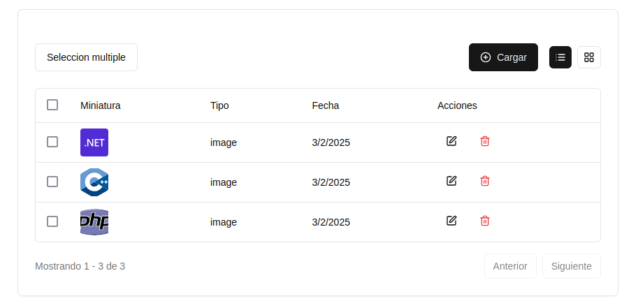
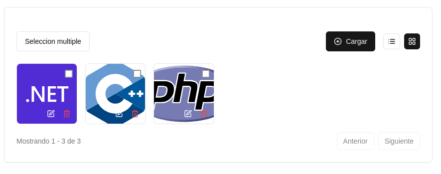

# 🖼️ Modulo Galeria Multimedia

**Una galería multimedia moderna con carga de imágenes, gestión cloud y UI avanzada**

## 🌟 Características Destacadas

- **Subida de imágenes a Cloudinary** con nombre único
- **Visualización en tabla y grid** interactivo
- **Gestión completa de medios** (CRUD)
- **Paginación avanzada** con búsqueda en tiempo real
- **Sistema de selección múltiple**
- **Diálogos modales elegantes** (Shadcn UI)
- **Optimizado para rendimiento** (Turso + SQLite)
- **Tipado fuerte con TypeScript**
- **Diseño responsive** y accesible

## 🛠️ Tecnologías Utilizadas

| Tecnología | Función | Versión |
|------------|---------|---------|
| [ Next.js](https://nextjs.org/) | Framework principal | 13.5+ |
| [ DrizzleORM](https://orm.drizzle.team/) | ORM para SQLite | 0.29+ |
| [ Turso](https://turso.tech/) | Base de datos edge | latest |
| [ Cloudinary](https://cloudinary.com/) | Almacenamiento de medios | 3.0+ |
| [ Hono](https://hono.dev/) | API endpoints | 3.7+ |
| [ Shadcn UI](https://ui.shadcn.com/) | Componentes UI | latest |
| [ TanStack](https://tanstack.com/) | Gestión de estado | 5.0+ |

## ✅ Funcionalidades Implementadas

### 🖼️ Gestión de Medios
- [x] Subida de imágenes con preview
- [x] Almacenamiento en Cloudinary
- [x] Metadatos en base de datos
- [x] Eliminación segura (Cloudinary + DB)
- [x] Actualización de metadatos

### 🎨 Interfaz de Usuario
- [x] Vista de tabla con paginación
- [x] Vista de grid responsive
- [x] Sistema de selección múltiple
- [x] Diálogos modales elegantes
- [x] Feedback visual con loaders
- [x] Búsqueda por nombre/URL
- [x] Filtros básicos por tipo

### ⚙️ Backend
- [x] API REST con Hono
- [x] Validación Zod
- [x] Tipado estricto
- [x] Manejo de errores
- [x] Paginación optimizada

## 🚧 Próximas Funcionalidades

### 🎥 Soporte Multimedia
- [ ] Subida de videos
- [ ] Reproductor integrado
- [ ] Soporte para Vimeo/YouTube
- [ ] Miniaturas de video

### 🔍 Mejoras de Búsqueda
- [ ] Búsqueda por nombre exacto
- [ ] Filtros avanzados (tamaño, fecha)
- [ ] Etiquetado de medios
- [ ] Búsqueda semántica

### 🛠️ Herramientas Adicionales
- [ ] Eliminación múltiple
- [ ] Drag & Drop
- [ ] Edición en lote
- [ ] Exportar metadatos
- [ ] Sistema de carpetas
- [ ] Compartir enlaces públicos

 👨‍💻 Contribuciones

Las contribuciones son bienvenidas!!.

Si encontras un error o queres mejorar algo, abri un issue o envía un pull request.